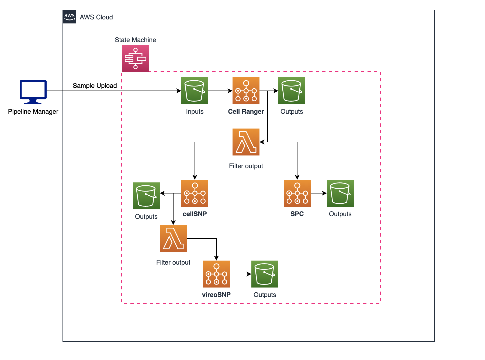

# Single-Cell-Analysis-Pipeline

## Overview

Analyzing sequenced single cell raw data requires considerable amount of compute resource and time. There exists a clear limitation to operate pipelines using only on-premise resources. Deploying the pipeline in AWS helped save cost and time through parallel computing and pay-as-you-go cost model. This repository shows how I integrated AWS services such as Batch, Step Functions, Lambda, EC2, and CloudFormation to form the whole pipeline in AWS.

## Diagram of the Pipeline



## Usage

1. Make CloudFormation stack by uploading the [template](./AWS/CloudFormation/CF_template.yaml) and providing appropriate [parameters](./AWS/CloudFormation/README.md).
2. Once the stack has been created, obtain the State Machine's ARN from the stack output.
3. If not already installed, install the AWS CLI version 2 (Linux & Mac)

```bash
$ curl "https://awscli.amazonaws.com/awscli-exe-linux-x86_64.zip" -o "awscliv2.zip"
$ unzip awscliv2.zip
$ sudo ./aws/install
```

4. Set configuration

```bash
$ aws configure
> AWS Access Key ID [None]: your id
> AWS Secret Access Key [None]: your key
> Default region name [None]: your region
> Default output format [None]: json
```

5. Make `run_pipeline.py` file executable

```bash
$ chmod +x run_pipeline.py
```

6. Prepare an input JSON file to submit to the pipeline. [sample file](./sample_input.json)

- Required variables:
  - "AWS_KEY" : your aws access key
  - "AWS_SECRET_KEY": your aws secret key
  - REGION: your region,
  - "SAMPLE_ID": sample ID name of the .fastq files
  - "CR_DOWNLOAD_BUCKET": S3 bucket name where Cellranger input files are stored
  - "CR_UPLOAD_BUCKET": S3 bucket name where Cellranger result files will be stored
  - "CR_CORE": Number of cores to operate Cellranger analysis
  - "CR_MEMORY": Memory in GiB for Cellranger analysis to operate
  - "CR_EXPECT_CELLS": Number of single cells to expect from the Cellranger analysis
  - "CS_UPLOAD_BUCKET" : S3 bucket name where cellSNP result files will be stored
  - "CS_THREADS": Number of threads for cellSNP analysis to operate (enter 22 to analyze all 22 chromosomes)
  - "CS_MIN_MAF": cellSNP's min MAF
  - "CS_MIN_COUNT": cellSNP's min count
  - "VS_UPLOAD_BUCKET" : S3 bucket name where vireoSNP result files will be stored
  - "VS_N_DONOR": Number of donors for vireoSNP analysis
  - "SPC_UPLOAD_BUCKET" : S3 bucket name where Souporcell result files will be stored
  - "SPC_THREADS" : Number of threads for Souporcell
  - "SPC_NUM_CLUSTERS" : Number of clustuers for Souporcell

7. Upload .fastq (raw sequenced )
8. Run the following command to start the sequencing pipeline

```bash
$ ./run_pipeline.py -i <json input file> -a <state machine arn>
```

- example

```bash
$ ./run_pipeline.py -i input.json -a arn:aws:states:ap-northeast-2:241046885174:stateMachine:SC_TEST_Pipeline
```

## Docker Images

### Cell Ranger

- Docker hub URI: chungwookahn/cellranger5.0.1:0.1
- Version: 5.0.1
- [10x genomics reference page](https://support.10xgenomics.com/single-cell-gene-expression/software/pipelines/5.0/what-is-cell-ranger)
- Main command: `cellranger count`
- Takes FASTQ files and performs alignment, filtering, barcode counting, and UMI counting.
- It uses the Chromium cellular barcodes to generate feature-barcode matrices, determine clusters, and perform gene expression analysis

### cellSNP

- Docker hub URI: chungwookahn/cell_snp:0.1.1
- Version: 0.3.2
- [source code](https://github.com/single-cell-genetics/cellSNP)
- pileup whole chromosome(s) for a single BAM/SAM file

### vireoSNP

- Docker hub URI: chungwookahn/vireo_snp:0.1
- Version: 0.5.0
- [vireoSNP documentation reference](https://vireosnp.readthedocs.io/en/latest/index.html)
- Vireo is primarily designed for demultiplexing cells into donors by modelling of expressed alleles

### Souporcell

- Docker hub URI: chungwookahn/souporcell:0.1
- Anaconda Installers version: Python 3.8, Anaconda3-2021.05-Linux-x86_64
- Fasta referance: cellranger 5.0.1 reference
- minimap2: 2.7-r654
- vartrix: 1.1.22
- freebayes: 1.3.1-dirty
- cargo: 1.53.0 (4369396ce 2021-04-27)
